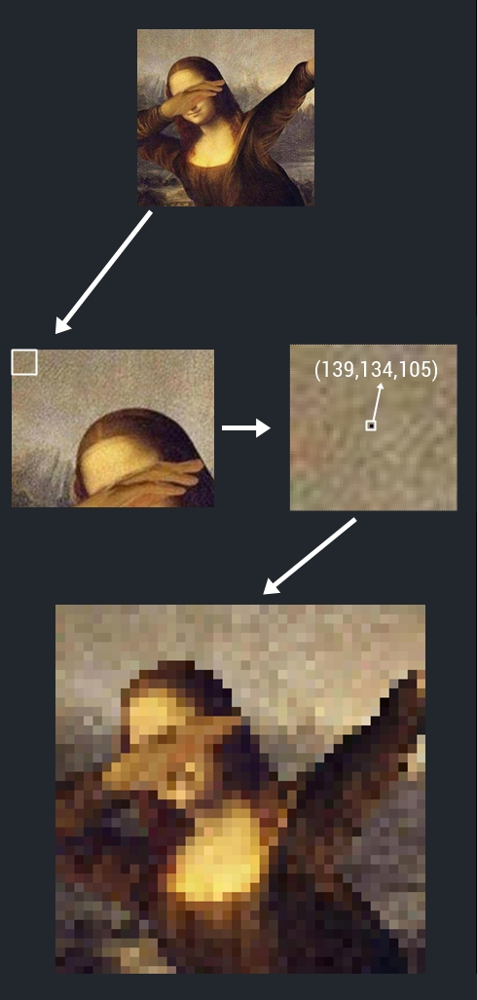

<a name="logo"/>

<a href="https://github.com/AlicanAKCA/pixera" target="_blank">
</img>
</a>

# pixera
Pixera is a new dimension for GAN (Generative Adversarial Network). Provides to create 'pixed' images for Pixel-Art. 

<a name="initial"/>

<a href="https://github.com/AlicanAKCA/pixera" target="_blank">
</img>
</a>

# pixera
life's pixel is beginning to change with pixera

<a name="logo"/>

<a href="https://github.com/AlicanAKCA/pixera" target="_blank">
</img>
</a>

