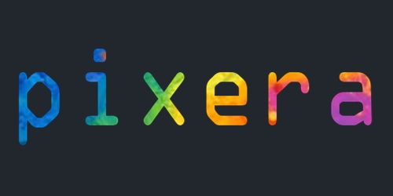
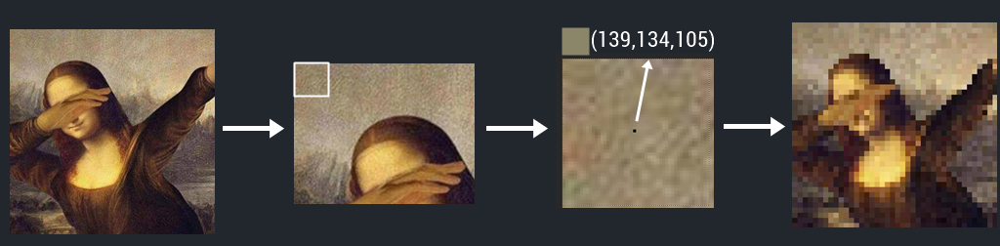

<a name="logo"/>
<div align="center">
<a href="https://github.com/AlicanAKCA/pixera" target="_blank">
</img>
</a>
</div>

# pixera
Pixera provides to create 'pixed' images for Pixel-Art. Pixera has two implementations for now. The first one is, Python Notebook in the examples directory can be used by developers who want to design their own trained model. You can also look at the [GAN Example](examples/GANExample1.ipynb) that I created. You can access full code of this project for free. Also don't forget to try Demo on [pixera](https://pixera.studio). 

The second one offers pixel art conversion for your images, including pictures and sketches. 

<a name="logo"/>
<div align="center">
<a href="https://github.com/AlicanAKCA/pixera" target="_blank">
</img>
</a>
</div>

## GAN and pixera

The pixera provides to change image type as you can see below. In this [GAN Example](https://www.kaggle.com/code/alicanakca/gan-example), images in the dataset are arranged by passing through the Pixera algorithm. Thus, pixel characters were created using the GAN algorithm. The trained models are available on the [Kaggle](https://www.kaggle.com/code/alicanakca/gan-example).

<a name="logo"/>
<div align="center">
<a href="https://github.com/AlicanAKCA/pixera" target="_blank">
</img>
</a>
</div>

## Object-Oriented Inference

Approach provides to combine two drawing features. With this option, you will have seen pixel art and cartoon art on the canva. Object-Oriented Inference is generated with pixera using U2NET. But firstly, image is given to the cartoonizer. And then U-Square Network create mask of detected object. After this process, mask and original object are given as input to the Pixera algorithm. 

<a name="logo"/>
<div align="center">
<a href="https://github.com/AlicanAKCA/pixera" target="_blank">
</img>
</a>
</div>

## Source Code Organization

| Directory             | Contents                                                           |
| -                     | -                                                                  |
| `src/`                | Includes main GAN algorithm. |
| `img/`                | Necessary images |
| `examples/`           | Will have added eternal examples, Fasten your belts!  |
| `methods/`            | Directory which includes method(s).|

## Initialization

```python
 git clone https://github.com/AlicanAKCA/pixera
```
```python
 pip install -r requirements.txt
```
```python
 !python app.py
```
It will have shown you an interface on your local host. Also, you can access full code and live Demo on [Hugging Face Repo](https://huggingface.co/spaces/Alican/pixera) and [pixera.studio](https://pixera.studio/create.html).

After running the app.py, will have shown you a link which provides to reach the interface.

```python
 http://127.0.0.1:7860/
```
## License

1. Copyright (C) Xinrui Wang, Jinze Yu. (White box cartoonization)

     All rights reserved.
     
     Licensed under the CC BY-NC-SA 4.0
     
     Also, Commercial application is prohibited license (https://creativecommons.org/licenses/by-nc-sa/4.0/legalcode).

2. Qin, Xuebin and Zhang, Zichen and Huang, Chenyang and Dehghan, Masood and Zaiane, Osmar and Jagersand, Martin (U2-Net: Going Deeper with Nested U-Structure for Salient Object Detection)

     Licensed under the Apache-2.0 

3. Copyright (C) Alican Akca. (Pixera Algorithm)

     Suitable for commercial use.
