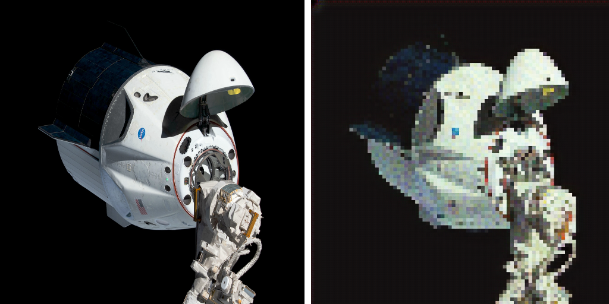

<a name="logo"/>
<div align="center">
<a href="https://github.com/AlicanAKCA/pixera" target="_blank">
</img>
</a>
</div>

# pixera
Pixera provides to create 'pixed' images for Pixel-Art. Pixera has two implementations for now. The first one is, Python Notebook in the examples directory can be used by developers who want to design their own trained model. You can also look at the [GAN Example](examples/GANExample1.ipynb) that I created. You can access full code of this project for free. Also don't forget to try Demo on [pixera](https://pixera.app). 

The second one offers pixel art conversion for your images, including pictures and sketches. 

<a name="logo"/>
<div align="center">
<a href="https://github.com/AlicanAKCA/pixera" target="_blank">
</img>
</a>
</div>

<a name="logo"/>
<div align="center">
<a href="https://github.com/AlicanAKCA/pixera" target="_blank">
</img>
</a>
</div>

## GAN and pixera

The pixera provides to change image type as you can see below. In this GAN Example, images in the dataset are arranged by passing through the pixera algorithm. Thus, pixel characters were created using the GAN algorithm. The trained models are available on the [Huggingface](https://huggingface.co/spaces/Alican/pixera).

<a name="logo"/>
<div align="center">
<a href="https://github.com/AlicanAKCA/pixera" target="_blank">
</img>
</a>
</div>

## Source Code Organization

| Directory             | Contents                                                           |
| -                     | -                                                                  |
| `data/`                | Scripts for the dataset.|
| `models/`                | Includes utilizer scripts. |
| `options/`                | Necessary options for the model. |
| `util/`            | Directory which includes method(s).|

## Initialization

```python
 git clone https://github.com/AlicanAKCA/pixera
```
```python
 pip install -r requirements.txt
```
```python
 python app.py
```
It will have shown you an interface on your local host. Also, you can access full code and live Demo on [Hugging Face Repo](https://huggingface.co/spaces/Alican/pixera) and [pixera.app](https://pixera.app/create.html).

After running the app.py, will have shown you a link which provides to reach the interface.

```python
 http://127.0.0.1:7860/
```
## Supportment

Hi there!

I am a Junior AI Developer with a passion for creating innovative solutions using cutting-edge technologies. I have experience in developing GAN models and I am currently working on a project called pixera, which aims to generate pixel art using deep learning techniques. I am excited about the potential of AI and its impact on society, and I am constantly exploring new ways to push the boundaries of what is possible. If you find my work valuable and would like to support me, you can buy me a coffee on  [**BuyMeACoffee**](https://www.buymeacoffee.com/alicanakca).

Thank you for your support!

<a name="logo"/>
<div align="center">
<a href="https://www.buymeacoffee.com/alicanakca" target="_blank">
</img>
</a>
</div>

<a name="logo"/>
<div align="center">
<a href="https://www.buymeacoffee.com/alicanakca" target="_blank">
</img>
</a>
</div>

## License

1. Copyright (C) Alican Akca. (Pixera Algorithm)

     Suitable for commercial use.
